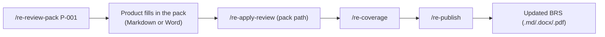

# User Manual — Business Requirements Reverse-Engineering Kit

This manual explains how to run the kit end to end:
- set it up
- run it against the whole mono repo, or against one component
- find what it produced
- run the review cycle with product
- regenerate the documents

The commands are identical in **GitHub Copilot Chat (VS Code, Agent mode)** and **Claude Code**.

---

## Contents

1. Key ideas (read once)
2. One-time setup
3. Mode A — analyse the whole mono repo
4. Mode B — analyse a single component
5. Command and agent reference
6. Where to find what
7. Review process: who edits what, and where
8. Regenerating the documents
9. When the code changes
10. Troubleshooting

---

## 1. Key ideas (read once)

| Term | Meaning |
|---|---|
| **Kit repo** | This repository. You open it in VS Code or Claude Code. **All output is written here.** |
| **Target** | The application's mono repo. It is **read only**; the kit never writes to it. |
| **Project** | One target registered in the kit: `projects/<name>/`. `projects/.active` says which project the commands work on. |
| **Working files** | `projects/<name>/requirements/`, organised by code component, with code citations. Used by the analysis and review team. |
| **Review pack** | `requirements/_review/<date>-<scope>.md`: a plain-language checklist product fills in |
| **Deliverable** | `projects/<name>/deliverables/Business-Requirements-Specification.md` (+ `.docx` / `.pdf`). This is the stakeholder document. It is **generated; never edit it.** |
| **Component** | A unit of code: a microservice, web-services layer, batch application, website, connectivity adapter or database |
| **Entry point** | Something that starts business logic: an API endpoint, message consumer, scheduled job, batch job or screen. **Progress is saved after every entry point.** |

**Golden rules**
- Always point the kit at the **mono repo root**, even when analysing one service. Citations then stay consistent, and cross-service links work.
- **Fresh session per component.** When a command says so, start a new chat (Copilot) or run `/clear` (Claude Code).
- **Never edit generated files:** the deliverables, `06-open-questions.md` and `07-suspected-defects.md`. Fix the source and regenerate.

---

## 2. One-time setup

### 2.1 Prerequisites

| Need | Why |
|---|---|
| Approval to use your AI tool on the codebase | Organisation policy |
| VS Code with GitHub Copilot (agent mode, prompt files enabled) **or** Claude Code | Runs the commands |
| Read access to the mono repo from your machine | Analysis |
| Python 3.9+ and `pip install -r kit/tools/requirements.txt` | Word/PDF output only |
| Edge, Chrome or Microsoft Word | PDF output only |
| Git (recommended) | Commit the kit repo after each component, as a checkpoint and for history |

### 2.2 Give the tool access to the mono repo

**Copilot (VS Code)**
1. Copy `reverse-kit.code-workspace.example` to `reverse-kit.code-workspace`.
2. Replace `D:/path/to/your/mono-repo` (it appears twice) with your mono repo path.
3. Use **File → Open Workspace from File…** and pick that file. Keep the kit folder first in the list.
4. Open Copilot Chat and choose **Agent** mode.

**Claude Code:** from the kit repo folder, run
```
claude --add-dir "D:\path\to\mono-repo"
```

### 2.3 Register the project

```
/re-init platform D:\path\to\mono-repo
```
This creates `projects/platform/`, records the branch and commit being analysed, makes `platform` the active project, and asks for your **output formats** (e.g. `md, docx, pdf`).
Switch between projects later with `/re-init <name>`.

---

## 3. Mode A — analyse the whole mono repo

Use this for the full programme (e.g. 75+ microservices). Work moves forward in **waves**, and every step is resumable.

### 3.1 The sequence

| # | Run | Session | What it does | Output |
|---|---|---|---|---|
| 1 | `/re-init platform <path>` | any | Registers the target | `projects/platform/project.md` |
| 2 | `/re-discover` | new | Inventories every component, folder by folder (resumable) | `component-map.md`, `00-overview/` |
| 3 | *You:* review `component-map.md` | — | Fix paths, names and prefixes before anything else | — |
| 4 | `/re-plan` (optionally name priority processes, e.g. *"prioritise trade placement"*) | new | Sizes components, splits huge ones, orders them into waves | `_run/plan.md` |
| 5 | `/re-next` | **new each time** | Takes the next component in the plan and extracts it. Repeat until the wave is done. Database and shared libraries come first, as wave 0. | `03-capabilities/<component>/` (+ `01-domain/` for the database) |
| 6 | `/re-next verify` | **new each time** | Independent check of each extracted component | `_verification.md` per component |
| 7 | `/re-coverage` | any | Recounts, consolidates questions and defects, checks citations | `00-overview/coverage-tracker.md`, `06`, `07` |
| 8 | `/re-process "<process name>"` | new | Traces each business process end to end (list in `00-overview/system-context.md`) | `02-processes/P-NNN-*.md` |
| 9 | `/re-review-pack P-001` | any | Plain-language pack for one product session | `_review/<date>-P-001-*.md` |
| 10 | *Product reviews the pack* | — | See section 7 | — |
| 11 | `/re-apply-review <pack path>` | any | Writes the decisions back into the working files | updated `rules.md`, `_questions.md`, `_defects.md` |
| 12 | `/re-publish` | any | Generates the stakeholder document (+ Word/PDF) | `deliverables/` |
| 13 | `/re-wiki` (optional; **only if `Wiki publishing` is on-request/auto in `project.md`**, otherwise only when you explicitly ask and confirm) | any | Publishes everything to the ADO wiki: one page per component, sub-pages when large | ADO wiki under `Wiki parent path` |

Repeat steps 5–12 for each wave. **While product reviews wave N, extract wave N+1.**

The UI, integration and batch components are part of the plan and are handled by `/re-next` automatically. You can also run them directly (section 5).

### 3.2 Running several sessions in parallel

Open two to five chat windows. Run `/re-next` in each. Every session claims a different component, recorded in `_run/claims/`, so they never collide.

**Claude Code only:** you can also ask for subagents, e.g.
> Use the re-extractor agent in parallel for cash-service, stock-service and client-service. Then use re-verifier on each folder, then run /re-coverage.

In **Copilot**, the same agents are available in the agent dropdown (`re-extractor`, `re-verifier`).

### 3.3 Checking progress

```
/re-next status
```
This shows counts per status and wave, active and stale claims, failures, and average time per component size. The time averages let you estimate the remaining effort.

---

## 4. Mode B — analyse a single component

Use this for a pilot, a quick look, or a deep-dive on one service. The target is still the **mono repo root**.

### 4.1 Steps (example: cash service)

**1. Register** (skip if done): `/re-init platform D:\path\to\mono-repo`

**2. Make the component known.** Choose one of:
- **Discover just its folder:**
  ```
  /re-discover Code/Microservice/cash service
  ```
- **Or add a row by hand** to `projects/platform/requirements/component-map.md`:

  | Component | Type | Repo path | Folder | Prefix | Tech stack | Invoked via | Notes |
  |---|---|---|---|---|---|---|---|
  | Cash service | Microservice | `Code/Microservice/cash service` | `cash-service` | CSH | | | |

  - **Repo path** is relative to the mono repo root.
  - **Folder** is the output folder name.
  - **Prefix** (2–4 letters) is used in IDs, e.g. `BR-CSH-001`.

**3. (Recommended once) Run the database model:** `/re-domain`. The service's rules can then refer to business entities.

**4. Extract.** Use the command that matches the component type:

| Component type | Command |
|---|---|
| Microservice / connectivity adapter | `/re-service cash-service` |
| Web-services (REST) layer | `/re-api <folder>` |
| Batch application | `/re-batch <folder> inventory`, then `/re-batch <folder>` (or a job range such as `BJ-001..BJ-020`) |
| Website (front or back office) | `/re-ui <folder>` |
| Third-party exchange | `/re-integration <counterparty>` |

If the session stops, run the same command again. It resumes from the last saved entry point.

**5. Verify in a NEW session:**
```
/re-verify projects/platform/requirements/03-capabilities/cash-service
```

**6. Review and publish (optional):**
```
/re-review-pack cash-service
/re-publish
```

**If a plan exists**, use `/re-next cash-service` instead of step 4. The plan's status and timings stay up to date.

### 4.2 Standalone analysis (exception)

To look at one service in total isolation, register its folder as its own project:
```
/re-init cash-only "D:\path\to\mono-repo\Code\Microservice\cash service"
```
You lose its links to the shared database and to other services. Use this only for a quick look.

---

## 5. Command and agent reference

| Command | Arguments | Use it to | Writes to (`requirements/` unless stated) |
|---|---|---|---|
| `/re-init` | `<name> [<repo path>]` | Register or switch the project | `projects/<name>/project.md`, `projects/.active` |
| `/re-discover` | `[sub-path]` | Inventory components | `component-map.md`, `00-overview/*`, `_run/discovery-progress.md` |
| `/re-plan` | `[refresh] [waves=<n>]` | Build or refresh the wave plan | `_run/plan.md`, `_run/claims/`, `_run/run-log.md` |
| `/re-next` | `[verify \| status \| <component>]` | Do the next planned unit | as per the component's command, plus `_run/*` |
| `/re-domain` | `[path to DB assets]` | Entities, lifecycles, DB rules | `01-domain/`, `03-capabilities/database/` |
| `/re-service` | `<component>` | Microservice / adapter rules | `03-capabilities/<component>/` |
| `/re-api` | `<component>` | Web-services catalogue and rules | `03-capabilities/<component>/api-catalogue.md` + rules |
| `/re-batch` | `<component> [inventory \| BJ range]` | Batch jobs | `03-capabilities/<component>/jobs/`, `file-layouts/`, `batch-schedule.md` |
| `/re-ui` | `<front-end \| back-office>` | Screens, journeys, roles | `05-user-journeys/…`, `03-capabilities/<ui>/rules.md` |
| `/re-integration` | `<counterparty>` | Third-party contract | `04-integrations/INT-NNN-*.md` |
| `/re-process` | `"<process name>"` | End-to-end process | `02-processes/P-NNN-*.md` |
| `/re-verify` | `<folder or file>` | Independent check (new session) | corrections in place, `_verification.md` |
| `/re-coverage` | — | Recount, consolidate, check | `00-overview/coverage-tracker.md`, `06-…`, `07-…` |
| `/re-review-pack` | `<P-NNN \| component \| BJ range \| …>` | Pack for a product session | `_review/<date>-<scope>.md` |
| `/re-apply-review` | `<pack path>` | Apply product decisions | rules, questions, defects files |
| `/re-publish` | `[draft \| baseline] [docx \| pdf \| both]` | Stakeholder document | `projects/<name>/deliverables/` |
| `/re-export` | `[file.md] [docx \| pdf \| both]` | Word/PDF of any document | next to the `.md` file |
| `/re-wiki` | `[build \| push \| publish] [--dry-run] [--prune]` | Publish to the Azure DevOps wiki | `projects/<name>/wiki/` (preview), then the ADO wiki |

**Agents**

| Agent | Used for | Started by |
|---|---|---|
| `re-extractor` | Extracting one component (or batch job range) in parallel with others | You ask for it (Claude Code), or pick it in the Copilot agent dropdown |
| `re-verifier` | An independent, sceptical check of one component's output | Same |

---

## 6. Where to find what

All paths are under `projects/<name>/`.

| I want… | Look in |
|---|---|
| **The document to give stakeholders** | `deliverables/Business-Requirements-Specification.md` / `.docx` / `.pdf` |
| **The same content as browsable wiki pages** | ADO project wiki → `<Wiki parent path>/<Product> Business Requirements` (preview locally in `wiki/`) |
| What has been analysed, and how far along it is | `requirements/00-overview/coverage-tracker.md`, `requirements/_run/plan.md` |
| The list of components and their IDs | `requirements/component-map.md` |
| A one-page picture of the system | `requirements/00-overview/system-context.md` |
| Business vocabulary | `requirements/00-overview/glossary.md` |
| What the business manages, and its states | `requirements/01-domain/entities/` |
| **How a business process works end to end** | `requirements/02-processes/P-NNN-*.md` |
| All rules of one service, with code evidence | `requirements/03-capabilities/<component>/rules.md` |
| What a service is responsible for | `requirements/03-capabilities/<component>/capability.md` |
| Every endpoint of the web-services layer | `requirements/03-capabilities/<component>/api-catalogue.md` |
| Batch jobs and the nightly schedule | `requirements/03-capabilities/<batch>/batch-schedule.md`, `jobs/BJ-*.md` |
| Third-party exchanges | `requirements/04-integrations/INT-*.md` |
| Screens and what users do | `requirements/05-user-journeys/` |
| **Everything awaiting a product decision** | `requirements/06-open-questions.md` |
| **Everything that looks wrong** | `requirements/07-suspected-defects.md` |
| Packs for product, and what was decided | `requirements/_review/` |
| The code version the analysis is based on | `project.md` |

**Reading order to understand the product:** system context → glossary → entities → processes → user journeys → capabilities (detail).

---

## 7. Review process: who edits what, and where

### 7.1 The cycle



### 7.2 What product fills in (the review pack only)

File: `projects/<name>/requirements/_review/<date>-<scope>.md`

| Section in the pack | Column to fill | Allowed values / content |
|---|---|---|
| **Rules** | **Decision** | `Confirmed`, `Changed`, `Rejected (bug)`, `Obsolete`, `Unsure` |
| **Rules** | **Correct wording / comment** | **Required for `Changed`:** the correct rule in business words. Optional otherwise. |
| **Questions for you** | **Answer** | Free text |
| **Things that look wrong** | **Decision** | `Confirmed bug`, `Intended`, `Won't fix` |

Product **doesn't** edit anything else. Leave the IDs and rule text as they are.

**If product prefers Word:**
1. `/re-export projects/<name>/requirements/_review/<pack>.md docx`, and send the `.docx`.
2. Product fills in the same columns in Word.
3. Someone copies the decisions back into the **Markdown** pack. `/re-apply-review` reads the Markdown, not the Word file.

### 7.3 Apply the decisions

```
/re-apply-review projects/<name>/requirements/_review/<date>-<scope>.md
```

| Decision | What happens in the working files |
|---|---|
| Confirmed | Rule Status → `Confirmed` |
| Changed | Status → `Changed`. The new wording is stored in **Product comments**. The original statement is kept, because it records how the system behaves today. A defect is raised if the code must change. |
| Rejected (bug) | Status → `Rejected`, and a defect is raised as `Confirmed bug` |
| Obsolete | Status → `Obsolete`, and a defect is raised: "candidate for code removal" |
| Unsure / blank | Back to `Draft`. A question is raised if there's a comment. |
| Question answered | `_questions.md` → Answer filled in, Status `Answered` |
| Defect decision | `_defects.md` → Decision filled in. `Intended` creates a new Confirmed rule. |

The pack is stamped `Applied <date>`, and `/re-coverage` runs automatically.

### 7.4 Who may edit which files

| File(s) | Who edits | How |
|---|---|---|
| `_review/*.md`, the decision columns | Product | By hand (or Word, then copied back) |
| `rules.md` **Status** and **Product comments** | Nobody by hand | Only via `/re-apply-review` |
| `rules.md` statement, source, confidence | Analysis team | When the extraction is wrong. Then run `/re-verify` on that folder. |
| `component-map.md` | Analysis team | After `/re-discover`, to fix names, paths and prefixes |
| `project.md` | Analysis team | Formats, Word template, new commit, **Wiki publishing** switch (`off` / `on-request` / `auto`) and ADO settings |
| `kit/RULES.md`, `kit/examples/` | Kit owner | To tune extraction quality (after the pilot) |
| `06-open-questions.md`, `07-suspected-defects.md` | **Nobody** | Generated by `/re-coverage` |
| `deliverables/*` | **Nobody** | Generated by `/re-publish` / `/re-export` |
| `wiki/*` and the ADO wiki pages under the parent path | **Nobody** | Generated by `/re-wiki`. Edits in ADO are overwritten. Give feedback through review packs. |

---

## 8. Regenerating the documents

| After… | Run |
|---|---|
| Applying a review pack | `/re-publish` (it already ran `/re-coverage`) |
| The analysis team corrected rules by hand | `/re-verify <folder>` → `/re-coverage` → `/re-publish` |
| New components extracted | `/re-coverage` → `/re-process …` (if processes are affected) → `/re-publish` |
| You only need a different format | `/re-export [file] docx\|pdf\|both` |
| Anything above, and you use the ADO wiki | `Wiki publishing: auto` → happens automatically in `/re-publish`. `on-request` → finish with `/re-wiki`. `off` → no upload (set the row to switch it on). |
| Product has confirmed enough to agree a baseline | `/re-publish baseline`: only Confirmed/Changed rules; everything else is listed as pending |

Each `/re-publish` increments the document version, reports the % confirmed, and checks that no requirement is missing.
**Commit the kit repo after each publish**, so every version of the specification is kept in Git history.

---

## 9. When the code changes

1. Update **Commit analysed** in `projects/<name>/project.md` (record the new commit and the date).
2. Re-run the affected components: `/re-service <component>` (or `/re-next <component>`). The commit recorded in `_progress.md` tells you which components were analysed on an older commit.
3. `/re-verify` → `/re-coverage` → `/re-publish`.

---

## 10. Troubleshooting

| Problem | Fix |
|---|---|
| "`<TARGET>` can't be read" | Copilot: add the mono repo to the workspace (2.2). Claude Code: `/add-dir <path>`. |
| A session stopped half-way | New chat or `/clear`, then the same command (or `/re-next`). It resumes from `_progress.md`. |
| A component shows as claimed by a dead session | `/re-next status` shows stale claims (older than 4 h). Delete the claim file in `_run/claims/`, or let `/re-next` take it over. |
| Commands don't appear when typing `/` | Copilot: Agent mode, the kit folder first in the workspace, prompt files allowed by policy. Claude Code: start it from the kit repo folder. |
| "python-docx missing" | `pip install -r kit/tools/requirements.txt` (or your internal mirror) |
| No PDF produced | The exporter tests Edge, then Chrome, then Word. Set `KIT_BROWSER=<path to browser>`, or use `--pdf-engine word`. |
| "diagram N not rendered" | The Mermaid diagram in the source `.md` is invalid (it would fail on GitHub too). Fix it in the working file and regenerate. |
| `/re-wiki`: settings missing | Copy `ado.properties.example` to `ado.properties` (git-ignored) and fill it in, or set the `project.md` rows. Run `python kit/tools/ado_wiki.py check` to see the effective values. |
| `/re-wiki`: authentication failed | Check `ADO_PAT` (not expired, scope Wiki Read & write), the org URL, and the project name. On-prem: check `ADO API version` and trust of the corporate certificate. |
| `/re-wiki`: a diagram doesn't render in ADO | ADO uses an older Mermaid version. Simplify that diagram in the source working file, then re-publish. |
| Output quality is too technical, vague or granular | Edit `kit/examples/good-vs-bad-rules.md` and `kit/RULES.md`, then re-run the component |
