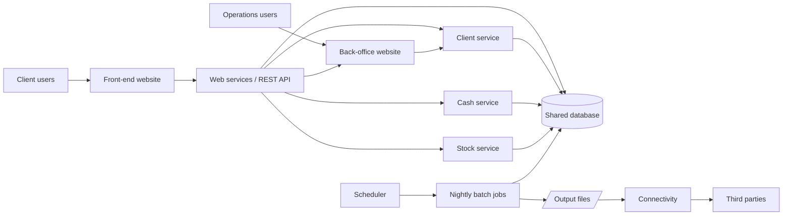

# System Context

`/re-discover` fills this in. It gives a business-level view of the platform: its components, the shared database, and the third parties it connects to.

## Components

| Component | One-line business purpose | Confidence | Details |
|---|---|---|---|

## Context diagram

## Interactions

| From | To | Mechanism (REST / event / DB / file) | Business reason | Evidence |
|---|---|---|---|---|

## Candidate end-to-end processes

| Proposed ID | Process | Likely entry point | Components |
|---|---|---|---|
