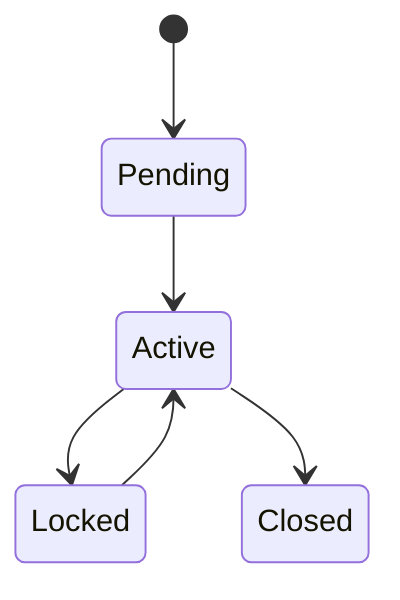

# ENT-<Name> — <Business name>

**Status:** Draft · **Owner component:** <component that writes it> · **Stored in:** `<table(s)>`

## Definition

<What this thing is in business terms, one paragraph.>

## Identifiers

| Identifier | Business meaning | Source |
|---|---|---|

## Key attributes (business-relevant only)

| Attribute (business name) | Meaning | Allowed values / format | Column / field | Source |
|---|---|---|---|---|

## Lifecycle

| From state | To state | Trigger / who | Rules | Source (where the status changes) |
|---|---|---|---|---|

## Relationships

| Related entity | Relationship (business) | Cardinality |
|---|---|---|

## Constraints and DB-resident rules

<Constraints, triggers, procedures that enforce rules on this entity, with BR-DB-… IDs.>

## Reference data

<Lookup values that define business categories for this entity.>

## Product comments
