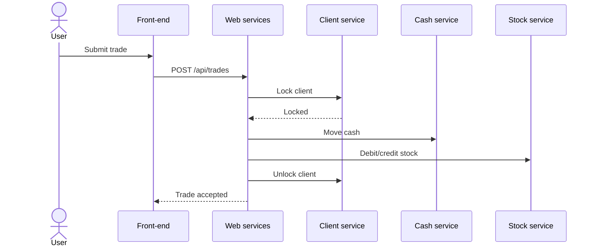

# P-NNN — <Process name in business words>

**Status:** Draft · **Last traced:** <YYYY-MM-DD> · **Components involved:** <list>

## Goal

<What the business achieves when this process completes.>

## Actors and triggers

- **Initiated by:** <role / system / schedule>
- **Entry point(s):** <UI action, API, inbound message, job, with Source>

## Preconditions

- <e.g. Client is active and not locked> (BR-…)

## Main flow (happy path)

| Step | Actor / component | What happens (business terms) | Rules applied | Source |
|---|---|---|---|---|
| 1 | Front-end | User submits a buy order | BR-FO-… | `path:line` |
| 2 | Client service | Client is locked for the duration of the trade | BR-CLI-… | `path:line` |

## Alternative and failure paths

| At step | Condition | What happens | State left behind / compensation | Rules | Source |
|---|---|---|---|---|---|
| 2 | Client already locked | Trade rejected: "Trade already in progress" | Nothing changed | BR-CLI-… | |
| 4 | Stock debit fails after cash moved | <Is the cash reversed? By whom? When?> | | | |

## Concurrency and timing

<Double submission, locks, ordering guarantees, cut-off times, timeouts, end-of-day behaviour.>

## Postconditions

- <State of each entity after success>

## Sequence diagram

<!-- Processes can also be scheduled, e.g. "End-of-day processing". Then the steps are batch jobs (BJ-NNN) in run order and the trigger is the scheduler. -->

## Overnight continuation

<Does a nightly batch job finish this process, e.g. settlement, interest, statements, files to third parties? List the BJ-NNN involved.>

## Gaps

<Components or steps not yet extracted, unresolved questions (Q-…), defects (D-…).>

## Product comments
