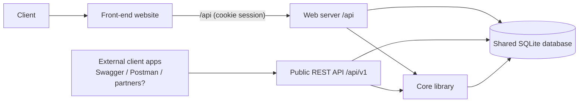

# System Context

`/re-discover` fills this in. It gives a business-level view of the platform: its components, the shared database, and the third parties it connects to.

**What the platform is (inferred):** a simulated stock-broking portal.
- **Client actions:** a client registers, funds a cash wallet (by simulated bank transfer or debit card), buys and sells shares in 41 listed US companies at simulated prices, and receives a PDF invoice and inbox notifications for every trade.
- **Public REST API:** offers the same core operations to external client applications.
- **No real money:** the UI and the invoices state this explicitly (`packages/web/src/components/ui.tsx:71-76`, `packages/db/src/services/invoicePdfService.ts:17`).

## Components

| Component | One-line business purpose | Confidence | Details |
|---|---|---|---|
| Front-end website | Self-service client portal: account, wallet funding, trading, portfolio, inbox | High | [front-end](../03-capabilities/front-end/capability.md) |
| Web server | Back end for the portal. Enforces the business rules and writes to the database. | High | [web-server](../03-capabilities/web-server/capability.md) |
| Public REST API | The same client operations for external client applications (token-based). Partial feature set. | High | [public-api](../03-capabilities/public-api/capability.md) |
| Core library | Shared price simulation, portfolio valuation, invoice numbering and PDF, and input validation rules | High | [core-library](../03-capabilities/core-library/capability.md) |
| Shared database | Single store for clients, wallets, transactions, companies, holdings, trades, invoices, messages | High | [database](../03-capabilities/database/capability.md) |

## Context diagram

## Interactions

| From | To | Mechanism | Business reason | Evidence |
|---|---|---|---|---|
| Front-end | Web server | REST over `/api`, session cookie | Every client action | `packages/web/src/api/client.ts:14-22`, `packages/web/vite.config.ts:19-24` |
| Web server | Database | Prisma ORM, direct | Read and write all business data | `packages/server/src/prisma.ts:1` |
| Public API | Database | Prisma ORM, direct | Same as the web server | `packages/api/src/modules/trades/tradesRoutes.ts:3` |
| Web server, Public API | Core library | In-process import | Price, valuation, invoice, validation rules | `packages/server/src/modules/trades/tradesRoutes.ts:6-7` |
| Web server ↔ Public API | — | **None.** They are independent processes writing to the same DB file. | — | `packages/db/src/prisma.ts:5-11` |

## Candidate end-to-end processes

| ID | Process | Entry point | Components |
|---|---|---|---|
| [P-001](../02-processes/P-001-place-trade.md) | Place a trade (buy / sell) | Trade screen → `POST /api/trades`; API `POST /api/v1/trades` | FE, WEB / API, LIB, DB |
| [P-002](../02-processes/P-002-add-funds.md) | Add funds to wallet | Payments screen → `POST /api/wallet/add-funds`; API `POST /api/v1/payments` | FE, WEB / API, LIB, DB |
| [P-003](../02-processes/P-003-register-client.md) | Register a new client | Register screen → `POST /api/auth/register`; API `POST /api/v1/users` | FE, WEB / API, LIB, DB |

## Discovery notes

- **No batch, no microservices, no back-office, no third-party connectivity.** Those kit phases were skipped.
- **Shared database across two independent processes.** The web server and the public API write the same SQLite file. The code comments acknowledge contention risk (`packages/db/src/prisma.ts:5-11`).
- **Duplicated business logic.** Trade, funding and registration logic is copy-pasted between `packages/server` and `packages/api` (see D-API-001).
- **Compiled output and local `.env` files are present.** `dist/` and `.env` are git-ignored and were excluded from extraction.
