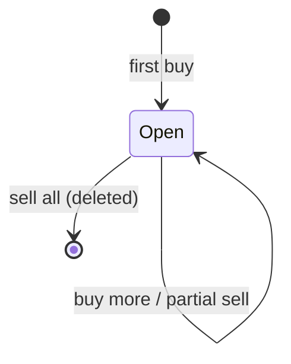

# ENT-Holding — Share holding (position)

**Status:** Draft · **Owner component:** Web server / Public API (trade execution) · **Stored in:** `Holding`

## Definition

The number of whole shares of one company that a client owns, and their average cost. There is at most one holding per client per company.

## Key attributes

| Attribute | Meaning | Format | Column | Source |
|---|---|---|---|---|
| Quantity | Shares owned | whole number | `quantity` | `packages/db/prisma/schema.prisma:63` |
| Average cost | Weighted average price paid per share | decimal | `avgCost` | `schema.prisma:64`, `packages/server/src/modules/trades/tradesRoutes.ts:58` |
| Current price / value / gain-loss | Calculated on every read, not stored | — | — | `packages/db/src/services/holdingsService.ts:11-27` |

## Lifecycle

| From state | To state | Trigger | Rules | Source |
|---|---|---|---|---|
| — | Open (qty = bought, avg cost = execution price) | First buy of a company | BR-WEB-028 | `tradesRoutes.ts:63-66` |
| Open | Open (qty ↑, avg cost re-weighted) | Further buy | BR-WEB-028 | `tradesRoutes.ts:56-62` |
| Open | Open (qty ↓, avg cost unchanged) | Partial sell | BR-WEB-030 | `tradesRoutes.ts:90` |
| Open | Removed (record deleted) | Sell of all remaining shares | BR-WEB-030 | `tradesRoutes.ts:87-88` |

## Constraints

- BR-DB-003: one holding per client per company
- BR-LIB-002: zero-quantity holdings are never shown

## Product comments
