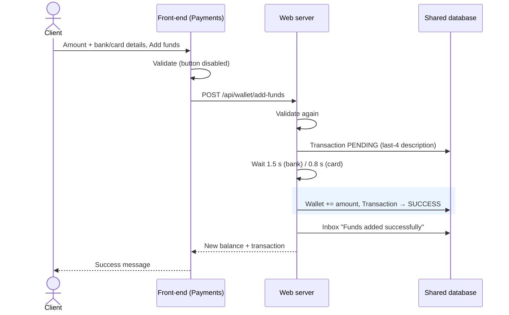

# P-002 — Add funds to wallet

**Status:** Draft · **Last traced:** 2026-10-04 · **Components involved:** Front-end, Web server (or Public API), Core library, Shared database

## Goal

A client credits their wallet from a bank account or debit card (simulated) so that they can buy shares.

## Actors and triggers

- **Initiated by:** A signed-in client.
- **Entry point(s):**
  - Portal: "Add funds" on Payments → `POST /api/wallet/add-funds` (`packages/server/src/modules/wallet/walletRoutes.ts:41`)
  - API: `POST /api/v1/payments` (`packages/api/src/modules/payments/paymentsRoutes.ts:13`)

## Preconditions

The client is signed in. **No KYC check** (Q-WEB-005). **No cumulative limit** (Q-LIB-001).

## Main flow

| Step | Actor / component | What happens | Rules | Source |
|---|---|---|---|---|
| 1 | Front-end | The client chooses Bank transfer or Debit card and enters the amount and details. The screen validates them. | BR-FO-010 | `packages/web/src/pages/Payments.tsx:56-82` |
| 2 | Web server | Validates again: amount in (0; 1,000,000], plus bank or card format rules | BR-LIB-013…018 | `walletRoutes.ts:44` |
| 3 | Web server | Records a **Pending** credit transaction described with the method and last 4 digits. Card and bank details are discarded. | BR-WEB-020, 021, BR-LIB-020 | `walletRoutes.ts:47-67` |
| 4 | Web server | Waits for the simulated processing time (bank 1.5 s / card 0.8 s) | BR-WEB-020 | `walletRoutes.ts:69-70` |
| 5 | Web server (one DB transaction) | Credits the wallet with the amount and marks the transaction **Success** | BR-WEB-020 | `walletRoutes.ts:72-81` |
| 6 | Web server | Sends the inbox message "Funds added successfully" with the new balance | BR-WEB-022 | `walletRoutes.ts:83-90` |
| 7 | Front-end | Shows "{amount} added successfully. New balance: …" | BR-FO-011 | `Payments.tsx:85-90` |

## Alternative and failure paths

| At step | Condition | What happens | State left behind | Rules | Source |
|---|---|---|---|---|---|
| 1–2 | Invalid input | Field errors | None | BR-FO-010, BR-LIB-013…018 | |
| 4 | Server stops during the delay | — | **Pending transaction left forever; wallet not credited; nothing reconciles it** | D-WEB-003 | `walletRoutes.ts:58-81` |
| 5 | DB busy for over 5 s | "Internal server error" | Pending transaction left, as above | D-DB-002, D-WEB-003 | |
| 6 | Message write fails | Client sees an error, **but the wallet is already credited** | A retry would credit twice | D-WEB-002, D-WEB-004 | |
| — | Payment declined | **Not possible.** Funding always succeeds; status Failed is never used. | — | Q-DOM-003 | |

## Concurrency and timing

- **Double-click:** the button is disabled while processing (BR-FO-011). The server has no duplicate check (D-WEB-004, D-API-005).

## Postconditions

Wallet increased by the amount. One Success credit transaction (Bank transfer or Debit card). One inbox message.

## Sequence diagram

## Gaps

No withdrawals (Q-DOM-002). No failed or declined path (Q-DOM-003).

## Product comments
