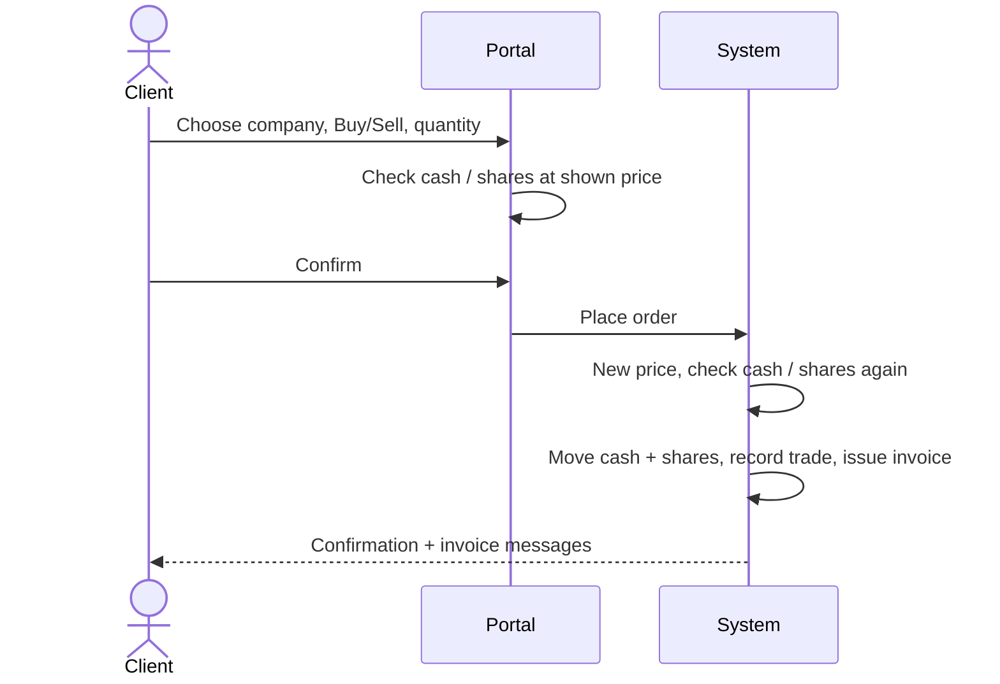

# Review pack — P-001 Place a trade

**Date:** 2026-10-04 · **Scope:** Buying and selling shares · **Estimated session:** 40 minutes
**Built from:**
- `02-processes/P-001-place-trade.md`
- `03-capabilities/web-server/rules.md`
- `03-capabilities/core-library/rules.md`
- `03-capabilities/front-end/rules.md`
- related `_questions.md` / `_defects.md` files

**How to fill it in:** for each rule, write a **Decision**:

| Decision | Meaning |
|---|---|
| **Confirmed** | Correct as described |
| **Changed** | Write the correct wording |
| **Rejected (bug)** | The system shouldn't do this |
| **Obsolete** | No longer needed |
| **Unsure** | Needs discussion |

Answer the questions in the **Answer** column.

---

## What the system does today

1. The client opens **Trade**, finds a company and clicks **Buy** or **Sell**. Prices move slightly (up to ±2%) every time they are refreshed. They are simulated, not real market data.
2. The client enters a whole number of shares and clicks **Review**. The screen checks that they have enough cash (for a buy) or enough shares (for a sell).
3. The client clicks **Confirm**. The system takes a **new** price at that moment, which may differ from the price shown, and checks cash or shares again.
4. If the checks pass, cash and shares move immediately, the trade is recorded as completed, and an invoice is issued.
5. The client gets two inbox messages: a trade confirmation and an invoice with a PDF link.
6. No brokerage fee is charged. The invoice shows a 0.1% fee "for information only".

## Rules

| ID | Rule (as the system behaves today) | Confidence | Decision | Correct wording / comment |
|---|---|---|---|---|
| BR-FO-004 | Every company in the list offers both Buy and Sell, even if the client owns none of its shares. | High | | |
| BR-FO-005 | Before confirming, the screen refuses: a quantity that isn't a whole number above zero; a buy costing more than the wallet balance (at the shown price); a sell of more shares than owned. | High | | |
| BR-FO-006 | An order takes two steps (Review, then Confirm). The confirmation screen warns that the final price may differ slightly from the one shown. | High | | |
| BR-FO-007 | Once Confirm is clicked, the button is disabled until the result arrives, so a double-click can't place two trades. | High | | |
| BR-LIB-001 | A share's price is its reference price moved randomly by up to ±2%, and it changes every time it is looked up. | High | | |
| BR-LIB-019 | An order must name a company, be a Buy or a Sell, and be for at least 1 whole share. There is no maximum order size. | High | | |
| BR-WEB-024 | An order for a company that doesn't exist is refused. | High | | |
| BR-WEB-025 | The trade is executed at a price taken at the moment of confirmation, not the price the client saw. There is no limit on how much the two may differ (up to about 4% today). | High | | |
| BR-WEB-026 | Trade total = execution price × number of shares, rounded to the cent. | High | | |
| BR-WEB-027 | A buy is refused if the wallet has less cash than the trade total. Exactly enough is allowed. | High | | |
| BR-WEB-028 | A buy takes the total out of the wallet and adds the shares to the client's holding. The average cost is recalculated as a weighted average. | High | | |
| BR-WEB-029 | A sell is refused if the client doesn't own enough shares. Short selling isn't possible. | High | | |
| BR-WEB-030 | A sell reduces the holding and removes it when no shares remain. The average cost of the remaining shares doesn't change. | High | | |
| BR-WEB-031 | A sell puts the full trade total into the wallet immediately. There is no settlement delay. | High | | |
| BR-WEB-032 | Every trade appears in the wallet history as a debit (buy) or credit (sell), e.g. "Buy 5 AAPL @ $228.10". | High | | |
| BR-WEB-033 | Every trade is recorded as Completed and gets an invoice with a unique number at the same moment. | High | | |
| BR-LIB-004 | Invoice numbers look like "INV-" followed by 8 letters and digits taken from the trade reference. | High | | |
| BR-WEB-034 | All the money and share movements of a trade happen together, or not at all. | High | | |
| BR-WEB-035 | After each trade the client receives a "Trade executed" message and an invoice message with a PDF link. | High | | |
| BR-WEB-036 | No brokerage, commission or tax is charged on trades. | Medium | | |
| BR-LIB-006 | The invoice shows a brokerage fee of 0.1% (minimum $0.50) marked "informational only — not charged". | High | | |

## Questions for you

| ID | Question | What happens today | Answer |
|---|---|---|---|
| Q-WEB-001 | Should a trade be stopped or re-confirmed if the price moves too much between the quote and the execution? By how much? | Executes at whatever the new price is (up to about 4% different) | |
| Q-LIB-002 | Should the 0.1% brokerage fee actually be charged? | Shown on the invoice, never charged | |
| Q-WEB-002 | Should refused or failed trades be recorded somewhere? | They leave no record | |
| Q-WEB-005 | Should trading require the client to be KYC-verified? | No check; KYC is never verified | |
| Q-WEB-006 | Should realised profit/loss on sales be calculated and shown? | Only paper gains on current holdings are shown | |
| Q-PRC-001 | Should trades settle immediately, or after a settlement cycle? Should trading be limited to market hours? | Immediate, any time of day | |
| Q-FO-001 | Should Sell be hidden for companies the client doesn't own? | Shown; refused at review | |

## Things that look wrong

| ID | What we found | Possible impact | Decision (Confirmed bug / Intended / Won't fix) |
|---|---|---|---|
| D-WEB-002 | The confirmation messages are sent after the trade is saved, separately. If sending fails, the client sees an error even though the trade went through. | The client may try again and buy twice | |
| D-WEB-004 | Only the browser button prevents duplicate orders. The system itself doesn't detect a repeated order. | Duplicates from retries, or from the public API | |
| D-WEB-006 | The screen checks cash using the shown price, but the system checks with the new price | Occasional "insufficient balance" right after the screen said OK | |
| D-API-001 | The public API has its own copy of all the trading rules | Changes must be made twice, and the copies can drift apart | |
| D-LIB-001 | Very rarely, two trades could get the same invoice number, which makes the trade fail | Rare failed trades with a generic error | |
